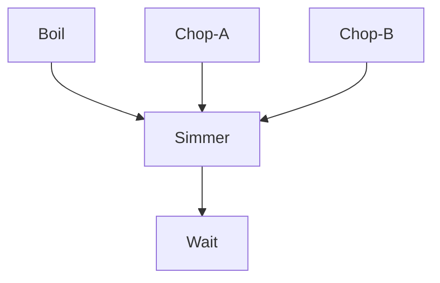
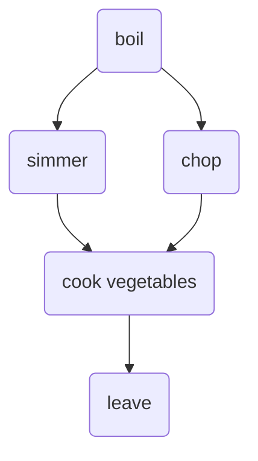
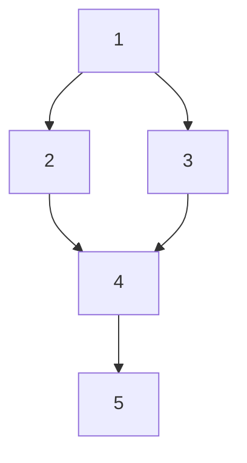
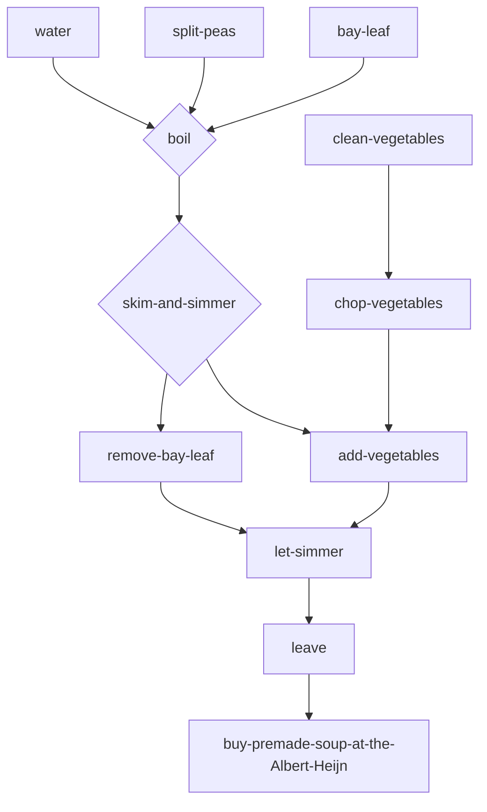

# Collaborative Document

2024-03-19 Parallel Python Day 1

Welcome to The Workshop Collaborative Document.

This Document is synchronized as you type, so that everyone viewing this page sees the same text. This allows you to collaborate seamlessly on documents.

----------------------------------------------------------------------------

##  🫱🏽‍🫲🏻 Code of Conduct

Participants are expected to follow these guidelines:
* Use welcoming and inclusive language.
* Be respectful of different viewpoints and experiences.
* Gracefully accept constructive criticism.
* Focus on what is best for the community.
* Show courtesy and respect towards other community members.
 
## ⚖️ License

All content is publicly available under the Creative Commons Attribution License: [creativecommons.org/licenses/by/4.0/](https://creativecommons.org/licenses/by/4.0/).

## 🙋Getting help

To ask a question, just raise your hand.

If you need help from a helper, place a pink post-it note on your laptop lid. A helper will come to assist you as soon as possible.

## 🖥 Workshop website

[link](https://esciencecenter-digital-skills.github.io/2024-03-19-ds-parallel/)

🛠 Setup

[link](<url>)

Download files

[link](<url>)

## 👩‍🏫👩‍💻🎓 Instructors

Johan Hidding, Flavio Hafner, Francesco Nattino

## 🧑‍🙋 Helpers

Sander van Rijn

## 👩‍💻👩‍💼👨‍🔬🧑‍🔬🧑‍🚀🧙‍♂️🔧 Roll Call
Name/ pronouns (optional) / job, role / social media (twitter, github, ...) / background or interests (optional) / city

> snipped

## 🗓️ Agenda
|  Time | Topic                  |
| -----:|:---------------------- |
| 09:30 | Welcome and icebreaker |
| 09:45 | Introduction           |
| 10:30 | Break                  |
| 10:45 | Measuring performance  |
| 12:00 | Coffee break           |
| 12:15 | Recap and Computing Pi |
| 12:45 | Wrap-up                |
| 13:00 | Lunch                  |
| 13:40 | Computing Pi           |
| 14:20 | Threads and processes  |
| 14:50 | Coffee break           |
| 15:05 | Threads and processes  |
| 15:45 | Tea break              |
| 16:00 | Threads and processes  |
| 16:30 | Wrap-up                |
| 16:45 | END                    |

## 🏢 Location logistics
* Coffee and toilets are in the hallway, just outside of the classroom.
* If you leave the building, 
  be sure to be accompanied by someone from the escience center to let you back in through the groundfloor door
* For access to this floor you might need to ring the doorbell so someone can let you in
* In case of an emergency, you can exit our floor using the main staircase.
  Or follow green light signs at the ceiling to the emergency staircase.
* **Wifi**: Eduroam should work. Otherwise use the 'matrixbuilding' network, password should be printed out and available somewhere in the room.

## 🎓 Certificate of attendance
If you attend the full workshop you can request a certificate of attendance by emailing to training@esciencecenter.nl .

## 🔧 Exercises

### Exercise. (5 min) Parallel and non-parallel 

Can you think of a task in your domain that is parallelizable? Can you also think of one that is fundamentally non-parallelizable? 

Please write your answers in the collaborative document. 

- *snipped*: 
    - Parallelizable: Apply exact same processing to monthly data
    - Non-Parallelizable: Optimisation; Order statistics
- *snipped*:
    - Parallel: Applying an operation on a radar image. Each resolution cell is independent
    - Non parallel: Running an iterative model
- *snipped*:
    - Parallelizable: Data Assimilation: many itterations of the same model timestep
    - Non-parallelizable: Hydrological model - depends on previous timestep
- *snipped*:
    - Parallelizable: Overrepresentation tests on different subsets of genes.
    - Non-Parallelizable: Optimization algorithm e.g. Newton's method.
- *snipped*:
    - Parellelizable: load single file in list of files, perform independent computation, save output
    - non-parallel: iterative machine learning updating
- *snipped*:
    - Parallel: calculating sums
    - non-parallel: serial stuff
- *snipped*:
    - parallel: calculate statistics for different classes
    - non-parallel: time series evolution signature analysis


### Exercise. (10 min) Parallelised Pea Soup (breakout) 
We have the following recipe: 

1. (1 min) Pour water into a soup pan, add the split peas and bay leaf and bring it to boil.
2. (60 min) Remove any foam using a skimmer and let it simmer under a lid for about 60 minutes. 
3. (15 min) Clean and chop the leek, celeriac, onion, carrot and potato. 
4. (20 min) Remove the bay leaf, add the vegetables and simmer for 20 more minutes. Stir the soup occasionally. 
5. (1 day) Leave the soup for one day. Reheat before serving and add a sliced smoked sausage (vegetarian options are also welcome). Season with pepper and salt. 

Imagine you’re cooking alone. 

- Can you identify potential for parallelisation in this recipe? 
- And what if you are cooking with the help of a friend help? Is the soup done any faster?
- Draw a dependency diagram using [Mermaid syntax](https://mermaid.js.org/intro/#flowchart)

Example:



David & Jordi


Raul, Andreas, Yan

Someone can check the water while the other does the chopping

Alexandre & Owen:


### Exercise (15 min) Implement an algorithm to compute $\pi$ (breakout)
Use only standard Python and the function `random.uniform`. The function should have the following interface:

```python
import random
def calc_pi(N):
    """Computes the value of pi using N random samples."""
    ...
    for i in range(N):
        # take a sample
        ...
    return ...
```

Also make sure to time your function!

#### Solution

```python
import random

def calc_pi(N):
    M = 0
    for i in range(N):
        # Simulate impact coordinates
        x = random.uniform(-1, 1)
        y = random.uniform(-1, 1)

        # True if impact happens inside the circle
        if x**2 + y**2 < 1.0:
            M += 1
    return 4 * M / N

%timeit calc_pi(10**6)
```


### Exercise (5 min) Daskify
Write `calc_pi_dask` to make the Numpy version parallel. Compare speed and memory performance with the Numpy version. 
NB: Remember that `dask.array` mimics the numpy API.


#### Solution

```python
import dask.array as da

def calc_pi_da(N):
    # chunk size is very important to get dask to work fast, size determined by experimentation
    pts = da.random.uniform(0.0, 1.0, (2,N), chunks=(2, N//10))
    M = da.count_nonzero((pts**2).sum(axis=0) < 1)
    return 4 * M / N

%%timeit calc_pi_da(10**7)
>>> 78.7 ms ± 2.33 ms per loop (mean ± std. dev. of 7 runs, 10 loops each)
```

### Exercise (5 min) Numbify
Create a Numba version of calc_pi. Time it.

#### Solution
Add a `@numba.jit` line on top of your first implementation of `calc_pi`.

```python
@numba.jit
def calc_pi_numba(N):
    M = 0
    for i in range(N):
        # Simulate impact coordinates
        x = random.uniform(-1, 1)
        y = random.uniform(-1, 1)

        # True if impact happens inside the circle
        if x**2 + y**2 < 1.0:
            M += 1
    return 4 * M / N

%timeit calc_pi_numba(10**6)
>>> 11.3 ms ± 334 µs per loop (mean ± std. dev. of 7 runs, 1 loop each)
```

### Try threading on a numpy function
Many Numpy functions unlock the GIL. Try to sort two randomly generated arrays using numpy.sort in parallel.

```python
import numpy as np

a = np.random.random(10**6)
b = np.random.random(10**6)

%%timeit -n 10 -r 10
np.sort(a)
np.sort(b)
>>> 121 ms +- 5.76 ms per loop 

%%timeit -n 10 -r 10
t1 = Thread(target=np.sort, args=(a,))
t2 = Thread(target=np.sort, args=(b,))

t1.start()
t2.start()

t1.join()
t2.join()
>>> 62 ms +- 3.18 ms per loop
```
It works! `np.sort` works outside of the GIL, so we actually get a 2x speedup


### Overhead and the gains from multiprocessing
Using the original `calc_pi` function, write a program the runs the computation across multiple processes and records the time taken.
First, vary the amount of work and fix the number of processes.
Then, vary the number of processes and fix the amount of work.

By inspecting the running times, investigate the scaling behavior of the programs. What can we learn?

It is recommended to have the programs in separate script and call the scripts from the notebook with `!python myscript.py`.

Hint: you can use [multiprocessing.starmap](https://docs.python.org/3/library/multiprocessing.html#multiprocessing.pool.Pool.starmap)


#### Solution


Call this function from e.g. inside the jupyter session with `!python mp_pool.py`
```python
#mp_pool.py
"""Vary the amount of work"""
import multiprocessing as mp
from itertools import repeat
from timeit import timeit
import random

def calc_pi(N):
    M = 0
    for i in range(N):
        # Simulate impact coordinates
        x = random.uniform(-1, 1)
        y = random.uniform(-1, 1)

        # True if impact happens inside the circle
        if x**2 + y**2 < 1.0:
            M += 1
    return 4 * M / N


def submit(ctx, N):
    with ctx.Pool() as pool:
        pool.starmap(calc_pi, repeat((N, ), 4))

if __name__ == "__main__":
    ctx = mp.get_context("spawn")
    for i in range(2, 8):
        res = timeit(lambda: submit(ctx, 10**i), number=5)
        print(f"using {10**i} samples took {res} seconds")
```

```python
#mp_pool_vary_workers.py
"""Vary the amount of work"""
import multiprocessing as mp
from itertools import repeat
from timeit import timeit
import random

def calc_pi(N):
    M = 0
    for i in range(N):
        # Simulate impact coordinates
        x = random.uniform(-1, 1)
        y = random.uniform(-1, 1)

        # True if impact happens inside the circle
        if x**2 + y**2 < 1.0:
            M += 1
    return 4 * M / N


def submit(ctx, n_jobs):
    n_workers=4
    with ctx.Pool(n_workers) as pool:
        pool.starmap(calc_pi, repeat((1_000_000//n_jobs, ), n_jobs))

if __name__ == "__main__":
    ctx = mp.get_context("spawn")
    for i in range(6):
        res = timeit(lambda: submit(ctx, 2**i), number=5)
        print(f"using {2**i} jobs took {res} seconds")
```

## 🧠 Collaborative Notes

### Introduction

There are roughly two kinds of processes: serial and (embarassingly) parallel. In a serial process, each next step directly depends on the result of the previous.

In (embarassingly) parallel processes, the work can easily be chunked up, distributed and worked on separately, to be combined 

```python
# serial
numbers = [1, 2, 3, 4]
total = 0

for n in numbers:
    total += n
    
print(total)
>>> 10
```

```python
# 
chunks = [numbers[:2], numbers[2:]]
sum(sum(chunk) for chunk in chunks)
>>> 10
```

### Diagrams

The Mermaid diagrams used in the exercises are called Dependency Graphs/Diagrams. The shape of these in general is called a Directed Acyclic Graphs (DAGs), since the connections have a direction and there is cycle/loop, since an intermediate step can never depend on a step coming after it

### Benchmarking

> Benchmarking is using a standardized task to compare the runtime of different versions of the same program

Benchmarking and profiling are sometimes used interchangably, but for our purposes we consider profiling a more low-level investigation into how much time each **part** of your program takes, rather than the program as a whole.

```python
import numpy as np
# this starts becoming computationally intensive from >= 10**9
# Look at your task manager / (b)top while this step runs:
result = np.arange(10**9).sum()
# wait until completion... it only uses 1 of your cores!
```
Note that the result is negative, because we get an integer overflow in numpy. In pure Python, it would automatically converto to big-number representation, but would be **way** slower still

Now with dask:
```python
import dask.array as da
# note that we can go higher 
work = da.arange(10**10).sum()
type(work)
>>> dask.array.core.Array
work.compute()
# Much faster, uses all your cores!
```

Matrix multiplication example:
```python
matA = da.random.normal((10_000, 10_000))
matB = da.random.normal((10_000, 10_000))
matC = matA @ matB  # @ is the python syntax for matrix multiplication
matC.compute()
# does a lot of work, and will probably fill your memory.
```
:::info
By parallelizing your work, you are more likely to run into memory bottlenecks, but addressing these is not in scope of this workshop. See e.g. the dedicated [dask documentation on the topic](https://distributed.dask.org/en/stable/memory.html) for more information
:::


We can use %%magic commands in Jupyter to do timing. `%%time` tracks the total time that that cell took to run:
```python
%%time
np.arange(10**7).sum()

>>> CPU times: user 13.1 ms, sys: 37.8 ms, total: 50.9 ms
>>> Wall time: 46.9 ms
>>> 49999995000000
```

But for more proper benchmarking, we want to get rid of any possible variability. For that we can use the `%%timeit` magic instead. This will run the cell many times and report an average with error bars instead:

```python
%%timeit
np.arange(10**7).sum()

>>> 19.7 ms ± 5.37 ms per loop (mean ± std. dev. of 7 runs, 100 loops each)
```

```python
!pip install memory_profiler
!pip install matplotlib

from memory_profiler import memory_usage

def sum_with_numpy():
    np.arange(10**8).sum()
    
def sum_with_dask():
    work = da.arange(10**8).sum()
    work.compute()

mem_np = memory_usage(sum_with_numpy, interval=0.005)
mem_da = memory_usage(sum_with_dask, interval=0.005)

from matplotlib import pyplot as plt
plt.plot(mem_np, label='numpy')
plt.plot(mem_da, label='dask')
plt.xlabel('Time Step')
plt.ylabel('Memory / MB')
plt.legend(loc=0)
plt.show()
```

```python
import psutil
# results will vary depending on your computer
psutil.cpu_count()
>>> 8  # 8 'logical cores'/hyperthreads
psutil.cpu_count(logical=False)
>>> 4  # 4 actual cores
```

```python
x = []
for n in range(1,9):
    # we use %timeit instead of %%timeit to work for a single line rather than the whole cell
    # -r restricts it to 1 instead of 7 runs
    # -o returns the result as a variable you can use within python
    time_taken = %timeit -r 1 -o da.arange(5*10**7).sum().compute(num_workers=n)
    x.append(time_taken.average)

!pip install pandas
import pandas as pd
data - pd.DataFrame({"n": range(1, 9), "t": x})
data.set_index("n").plot()
```


### Computing $\pi$

If you take uniformly randomly distributed x and y coordinates between -1 and +1, then these points will be in a square of area 4. Some will fall inside a circle with radius 1, and area $\pi r^2$. By sampling many points (N) and counting how many fall within the circle (M), you can approximate $\pi$.


Given the diagram above, you can see that $A_1 / A_2 = 4r^2 / \pi r^2 = 4/\pi$ This ratio still holds if you only sample a quarter of the square, so sampling your x and y uniformly between 0 and 1.

Step 1 before parallelizing: use numpy!
```python
import numpy as np

def calc_pi_np(N):
    pts = np.random.uniform(0.0, 1.0, (2,N))
    M = np.count_nonzero((pts**2).sum(axis=0) < 1)
    return 4 * M / N

%%timeit calc_pi_np(10**6)
>>> 15.6 ms ± 219 µs per loop (mean ± std. dev. of 7 runs, 100 loops each)
```

### Numba

We can use the `numba` package to just-in-time (JIT) compile our pure Python code to be much faster

```python
import numpy as np
import numba

@numba.jit
def sum_range_numba(a):
    x = 0
    for i in range(a):
        x += i
    return x
```

Let's compare implementations

```python
#naive python
time_naive = %timeit -o sum(range(10**7))
>>> 160 ms ± 8.57 ms per loop (mean ± std. dev of 7 runs, 10 loops each)

#numpy
time_numpy = %timeit -o np.arange(10**7).sum()
>>> 17.4 ms ± 256 µs per loop (mean ± std. dev of 7 runs, 100 loops each)

#numba
time_numba = %timeit -o sum_range_numba(10**7)
>>> 200 ns ± 27.2 ns per loop (mean ± std. dev of 7 runs, 1,000,000 loops each)

time_numpy.average / time_numba.average
>>> 86929.18703  # numba jit compiled is much faster!
```

Note that numba takes some time to compile your function the first time you call it:
```python
%time sum_range_numba(10**7)
>>> CPU times: user 574 ms, sys: 217 ms, total: 791 ms
>>> Wall time: 791 ms
>>> 49999995000000

# Second time is much faster!
%time sum_range_numba(10**7)
>>> CPU times: user 173 µs, sys: 95 µs, total: 268 µs
>>> Wall time: 298 µs
>>> 49999995000000

# Has to be re-compiled for new input types
%time sum_range_numba(10.**7)
>>> CPU times: user 200 ms, sys: 4.17 ms, total: 204 ms
>>> Wall time: 199 ms
>>> 49999995000000
```

### Threads

Difference between threads and processes: threads share memory, processes have to explicitly communicate between each other to share values.


```python
from threading import Thread

import random
def calc_pi(N, name=None)
    printing = name is not None
    if printing:
        print(f"{name}: starting")
    M = 0
    for i in range(N):
        x = random.uniform(-1,1)
        y = random.uniform(-1,1)
        if x**2 + y**2 < 1:
            M += 1
    if printing:
        print(f"{name}: Done")
        
    return 4*M/N


%%time
calc_pi(10**7)
>>> CPU times: user 6.45 s, sys: 0 ns, total: 6.45 s
>>> Wall time: 6.45 s
```

Let's see if we can distribute this work using threads:

```python
n = 10**7 // 2
t1 = Thread(target=calc_pi, args=(n, "Thread 1"))
t2 = Thread(target=calc_pi, args=(n, "Thread 2"))

t1.start()
t2.start()

print("Threads have been started")

t1.join()
t2.join()
>>> Thread 1: starting
>>> Thread 2: starting
>>> Threads have been started
>>> Thread 2: Done
>>> Thread 1: Done
>>> CPU times: user 5.24 s, sys: 37.2 ms, total: 5.27 s
>>> Wall time: 5.25 s
```

We basically get no speedup. This is because of the Global Interpreter Lock (GIL): it only allows one Python thread to actually be active at the same time. Even if we create multiple threads, only one will run at any time. To actually get speed-up, we need to either get the code to run outside of Python, or to have multiple Python processes running

### Circumventing the GIL

#### Numba

numba has a `nogil` option to get around the GIL:
```python
@numba.jit(nopython=True, nogil=True)
def calc_pi_nogil(N):
    M = 0
    for i in range(N):
        x = random.uniform(-1,1)
        y = random.uniform(-1,1)
        if x**2 + y**2 < 1:
            M += 1
        
    return 4*M/N

@numba.jit(nopython=True)
def calc_pi_with_gil(N):
    M = 0
    for i in range(N):
        x = random.uniform(-1,1)
        y = random.uniform(-1,1)
        if x**2 + y**2 < 1:
            M += 1
        
    return 4*M/N

%timeit calc_pi_nogil(10**7)
>>> 96.2 ms ± 10.3 ms per loop (mean ± std. dev. of 7 runs, 10 loops each)

%timeit calc_pi_with_gil(10**7)
>>> 99.5 ms ± 2.76 ms per loop (mean ± std. dev. of 7 runs, 1 loop each)
```
No difference! We're telling numba to let the code run out of the GIL, but if we're not calling it in multiple threads, then we're not parallelizing it

### Multiprocessing

```python
from multiprocessing import Process

%%timeit
if __name__ == "__main__":
    n = 10**7//2
    p1 = Process(target=calc_pi, args=(n,))
    p2 = Process(target=calc_pi, args=(n,))

    p1.start()
    p2.start()
    
    p1.join()
    p2.join()

>>> 4.91 s ± 485 ms per loop (mean ± std. dev. of 7 runs, 1 loop each)

%%timeit
calc_pi(10**7//2)
calc_pi(10**7//2)
>>> 7.86 s ± 443 ms per loop (mean ± std. dev. of 7 runs, 1 loop each)
```

We actually get speedup, without having to do anything with the GIL.

You can also use the context to retrieve processes:

```python
ctx = mp.get_context("spawn")  # or "fork" or "forkserver", depends on your OS
# "spawn" should be available on all OSs, but fails on Linux in 
p1 = ctx.Process(target=calc_pi, args=(n,))
p2 = ctx.Process(target=calc_pi, args=(n,))
```


## 💬 Feedback

### 🎉 What went well?

- Clear explanation of all the different options you have: learned a lot 
- nice content
- Learned lots of useful things! Great pace, good depth in the content.
- The pace was nice, fast at times but kept me awake
- The schedule and breaks were nice


### 💡 What could be better?

- A overview/comparison of the different types/tools that exist would be useful. i.e. in this case: try this; but in that case, try that. 
- Guidance on when to use different types of parallelism
- Maybe running all within a server so we all have access to similar resorces and results are comparable?
- The exercise instruction could be clearer
- A non trivial example would be great to see.

## ❓ Questions

**Q: does combining numba with numpy work better than just python?**
A: No, with pure python it can compile everything down, while it can't change/improve anything about numpy code

**Q: should we use @numba.jit(nopython=True)?**
A: It's usually recommended to yes, that's also why there's a separate @numba.njit function to make it easier to use

**Q: Can we combine numba with dask?**
A: Naively adding the @numba.jit decorator on the dask function does not work: just like with numpy, dask can't improve anything about it. Numba has some options to try automatic parallelization ([docs](https://numba.pydata.org/numba-doc/latest/user/parallel.html))

**Q: Can you run into problems with two threaded numpy calls accessing the same memory**
A: Possibly, but most numpy functions are 'pure' functions, in that they read the original memory and write their result to a copy. If you do in-place value changes, then indeed the GIL is not there to protect you.

**Q: Can you mark something as constant/immutable in Python?**
A: No, Python does not have anything in the language to enforce something like that. Unlike [Rust](https://doc.rust-lang.org/book/ch03-01-variables-and-mutability.html) :crab: 

**Q: How do I get results back from a single thread/process?**
A: see [tomorrow's document](https://tinyurl.com/parallel-python-2024-day2)

## 📚 Resources

- [NL-RSE](https://nl-rse.org/pages/meetups) (should be updated)
- [Dask Documentation on Memory Management](https://distributed.dask.org/en/stable/memory.html)
- [Blog by Sander on `timeit`](https://sjvrijn.github.io/2019/09/28/how-to-timeit.html)
- [Python `random` module documentation](https://docs.python.org/3/library/random.html#random.uniform)
- [Matt Parker's Distributed Pi computation](https://www.youtube.com/watch?v=LIg-6glbLkU)
- [Dask Chunks](https://docs.dask.org/en/stable/array-chunks.html)
- [Numba's built-in parallelization options](https://numba.pydata.org/numba-doc/latest/user/parallel.html)
- [`concurrent.futures`: higher-level interface for multiprocessing](https://docs.python.org/3/library/concurrent.futures.html)
